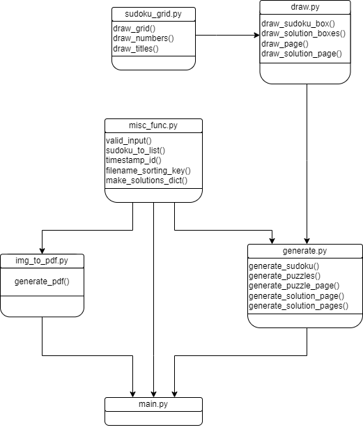

# Sudoku Book Generator

This Python project automates the generation of sudoku puzzle books in PDF format, complete with solutions. 

It utilizes code from [RutledgePaulV/sudoku-generator](https://github.com/RutledgePaulV/sudoku-generator) to generate the sudoku puzzles themselves, and then formats them into pages before concatenating them into a single PDF document.

## How it Works

1. The sudoku generator algorithm from [RutledgePaulV's repository](https://github.com/RutledgePaulV/sudoku-generator) is utilized to generate a given amount of puzzles and solutions, storing them as text files.

2. The generated puzzles are formatted into 1800×2700px (6×9" 300 dpi) PNG images for pages.

3. The formatted puzzles and solutions are then combined into a single PDF file.

## Usage

To use this sudoku book generator, you can follow these steps:

1. Clone the repository:

    ```
    git clone https://github.com/anna-st-40/sudoku-book-generator
    ```

2. Install the required dependencies:

    ```
    pip install -r requirements.txt
    ```

3. Run the Python script to generate your Sudoku book:

    ```
    python main.py
    ```

4. The script will ask the number of each difficulty level desired, then will generate the puzzles, pages, and final PDF. These will be in a folder in the same directory as your cloned repository, and will be named according to the time that you ran the script, according to the following convention:
    ```
    sudoku_YYYYMMDDHHMMSS
    ```

## Diagram


## Next steps to do
- Refactor: PdfMerger is deprecated and will be removed in pypdf 5.0.0. Use PdfWriter instead.
- Change font sizes and line widths to look nicer